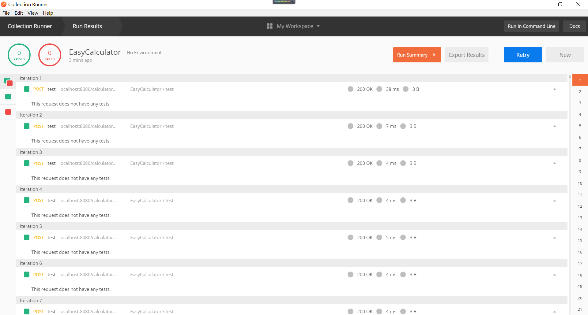
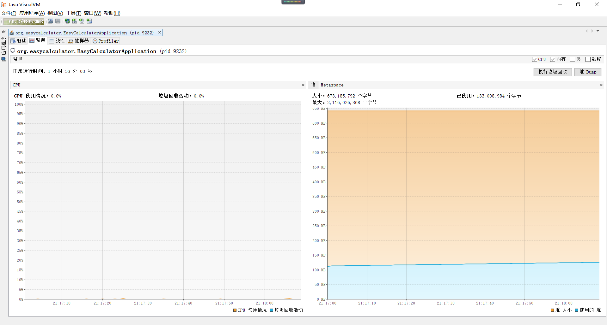
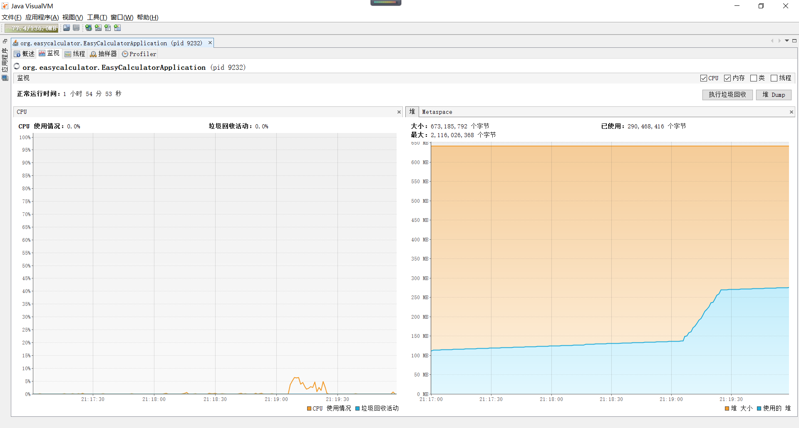
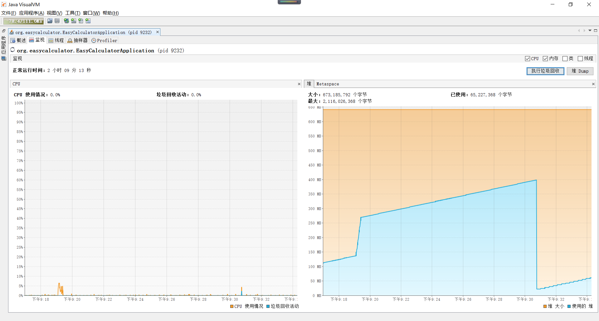

Report
======
使用工具
----
Postman + Java VisualVM

操作步骤
----
1. 在IntelliJ IDEA中启动服务
2. 使用Postman的Collecion Runner功能，创建1000个并发请求
3. 在Java VisualVM中监控JVM使用情况，并观察CPU与内存占用变化趋势

监控结果
----
1. Postman

	

    大多数请求的响应时间均在5ms以下，仅有起始的数个请求（1、2）响应超过5ms。

2. Java VisualVM

	
	

	CPU占用率在处理请求期间较为稳定，基本维持在5%以下；

	堆占用在处理请求过程中线性增长，直至完成所有请求处理而无下降趋势。

	无请求时堆占用缓慢增长，可能存在内存泄漏。

	

	强制垃圾回收后，堆占用骤降。

注释
----
Q: 为何使用Java VisualVM？

A: 可选择单一的JVM进程进行监控，较大程度上排除其他Java与非Java进程所产生的干扰。